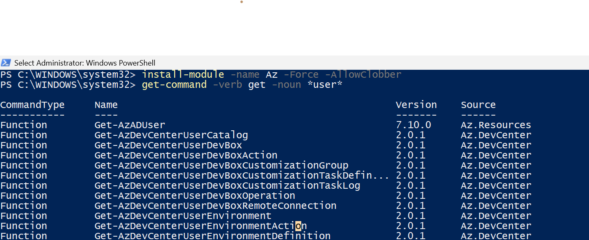
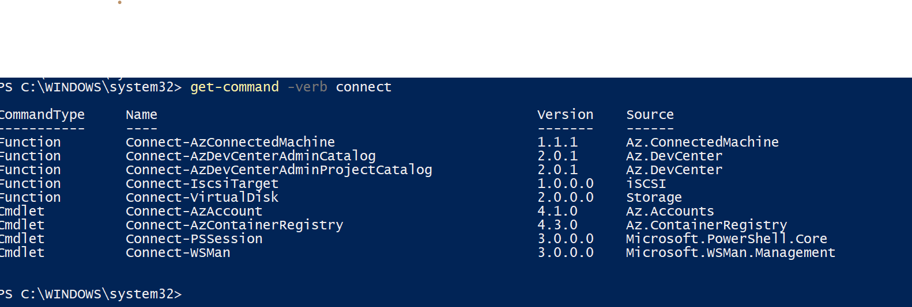
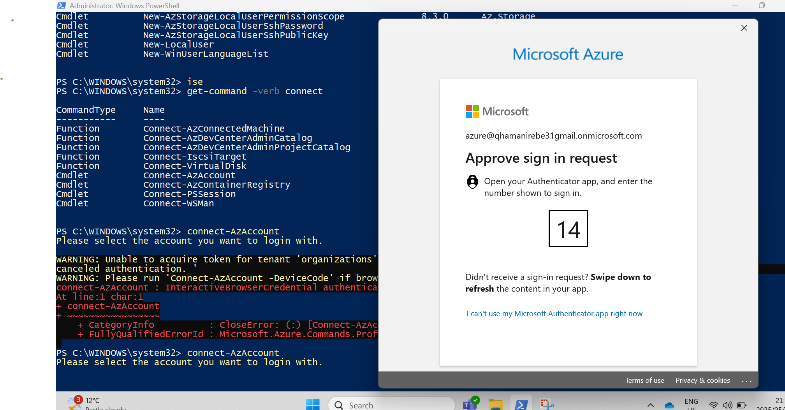
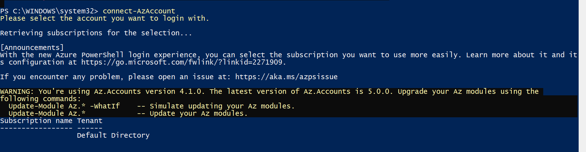
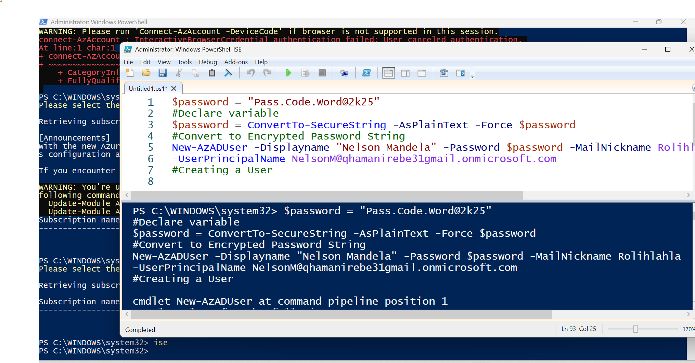
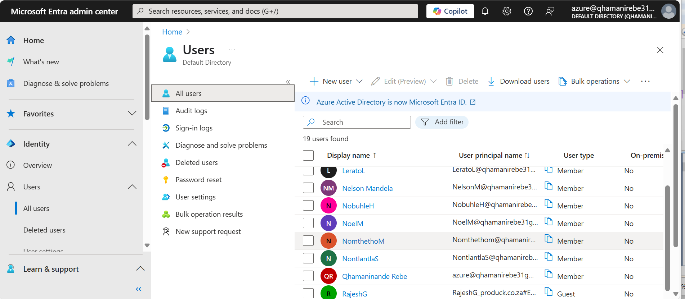

# azure-pws-admin

# PowerShell Administration in Azure – User Management Lab (AZ-104)

This lab demonstrates how to manage Microsoft Entra ID (formerly Azure AD) users using **PowerShell**, as part of preparing for the **AZ-104 Azure Administrator** certification.

---

## 🔧 Objectives

* Install the Azure PowerShell module
* Connect PowerShell to Azure
* Discover available Azure cmdlets
* Create a user with a secure password
* Validate the user creation in the Azure portal

---

## 🧰 Prerequisites

* PowerShell 5.1 or later
* Administrative access to your machine
* Azure account (with access to Entra ID / Azure AD)

---

## 📥 Install Azure PowerShell Module

```powershell
Install-Module -Name Az -Force -AllowClobber
```

---

## 🔗 Connect to Azure

```powershell
Connect-AzAccount
```

> This opens a login window. Sign in with your Azure credentials.

---

## 🔎 Discover Useful Cmdlets

```powershell
# Find connect-related commands
Get-Command -Verb Connect

# Explore user-related commands
Get-Command -Verb Get -Noun *user*
Get-Command -Verb New -Noun *user*
```

> You can use [PowerShellGallery.com](https://www.powershellgallery.com) for syntax and module references.

---

## 🧪 Create a New Azure AD User

```powershell
# Define password
$password = "Pass.Code.Word@2k25"
$securePassword = ConvertTo-SecureString -AsPlainText -Force $password

# Create user
New-AzADUser -DisplayName "Nelson Mandela" \
             -Password $securePassword \
             -MailNickname "Rolihlahla" \
             -UserPrincipalName "NelsonM@qhamanirebe31gmail.onmicrosoft.com"
```

> ⚠️ Replace the domain with your tenant’s domain.

---

## ✅ Verify the User

After running the script:

1. Log into [https://entra.microsoft.com](https://entra.microsoft.com)
2. Go to **Users** → Verify that "Nelson Mandela" appears in the list.

---

## 📸 Screenshots

Screenshots are located in `/images/` folder.

1.  – Get-Command -Verb Get -Noun *user*
2.   – Get-Command -Verb Connect
3.   – Approve sign-in request
4.   – Successful authentication
5.   – Create user script
6.   – Verification on Entra

---

## 📌 Key Takeaways

* PowerShell enables **faster**, **repeatable**, and **scripted** management.
* Cmdlets like `New-AzADUser` simplify bulk or automated user provisioning.
* This lab forms a foundation for further scripting, including bulk user creation and license assignment.

---

## 🧭 Next Steps

* Automate user creation with CSV input
* Explore license assignment via PowerShell
* Compare PowerShell with Azure CLI for same tasks

---

> 💬 Feedback and suggestions welcome! Feel free to open an issue or fork the repo.
